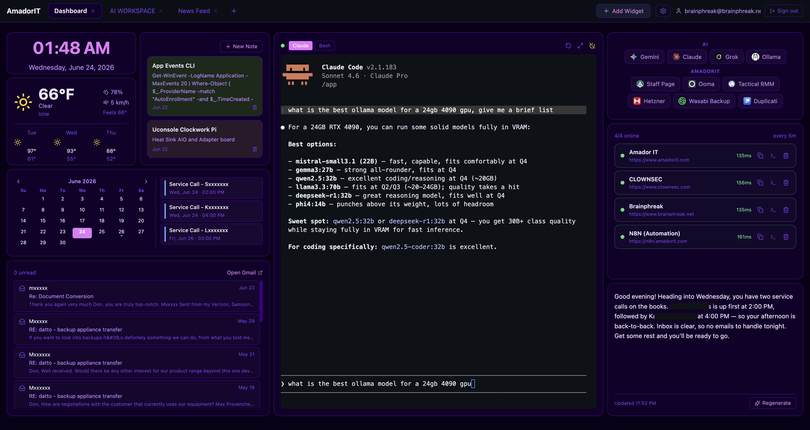
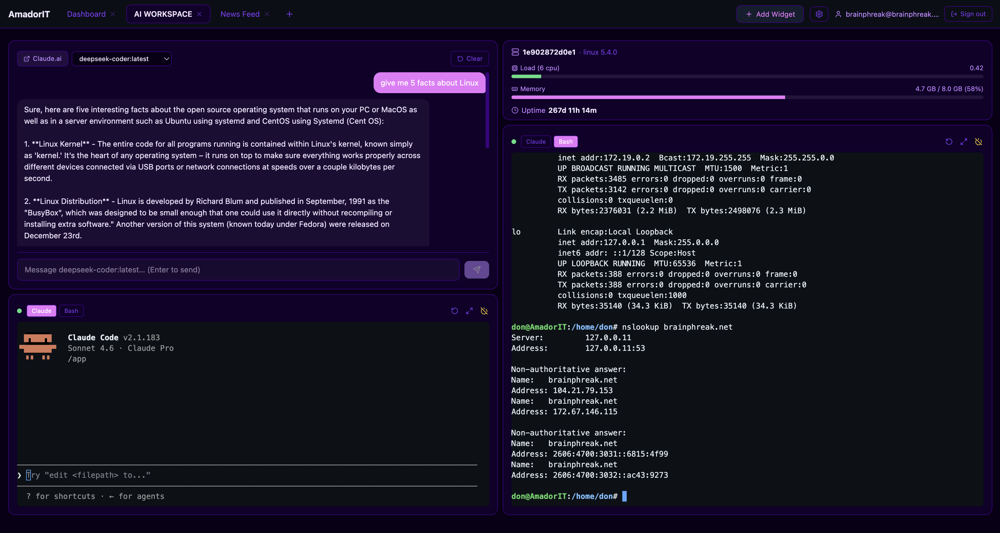
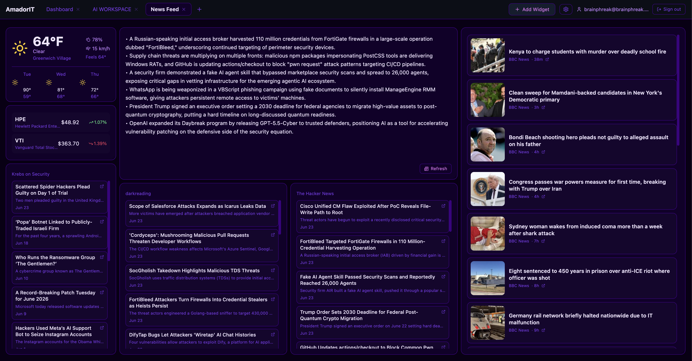
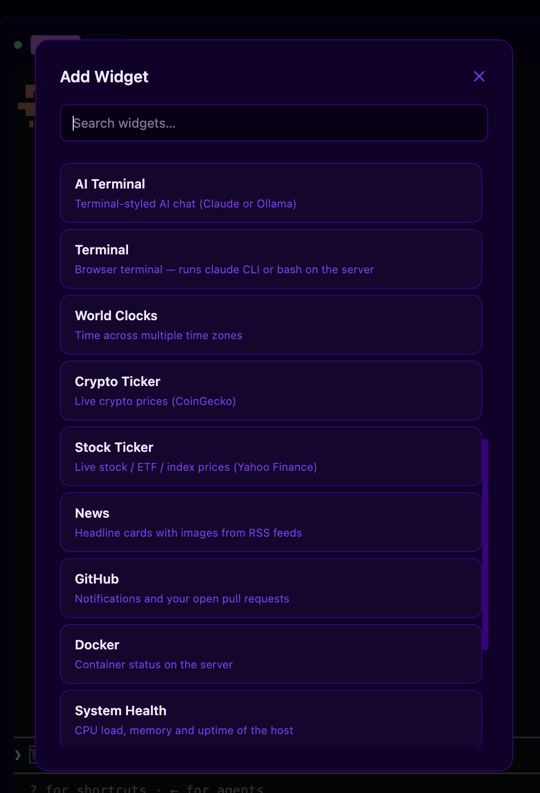
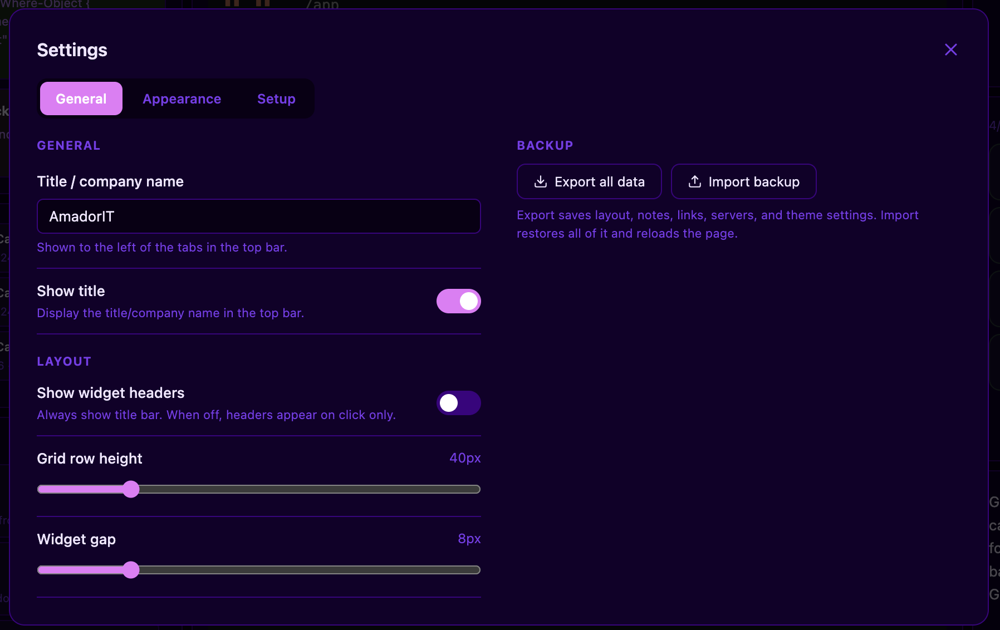
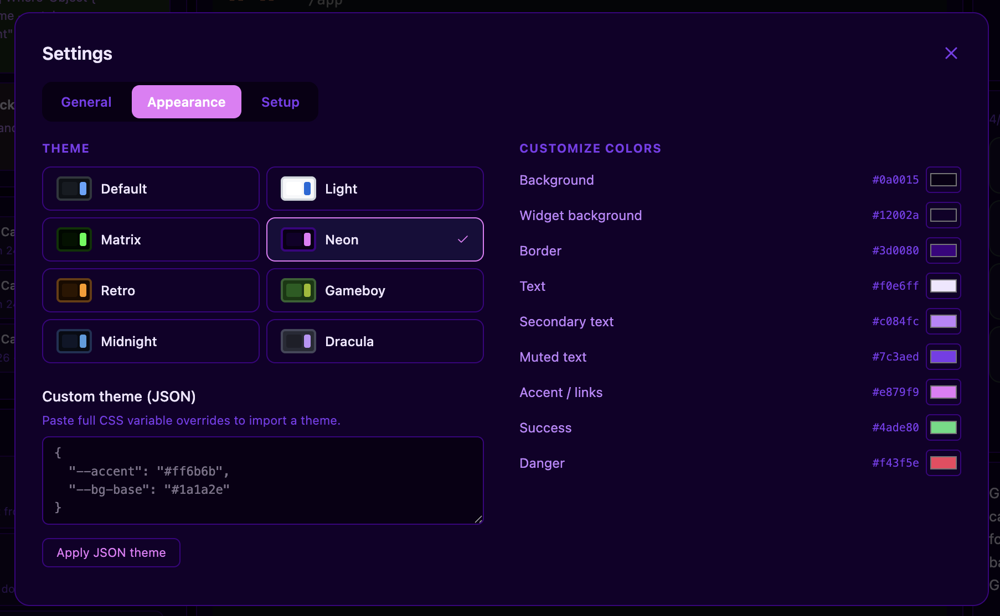
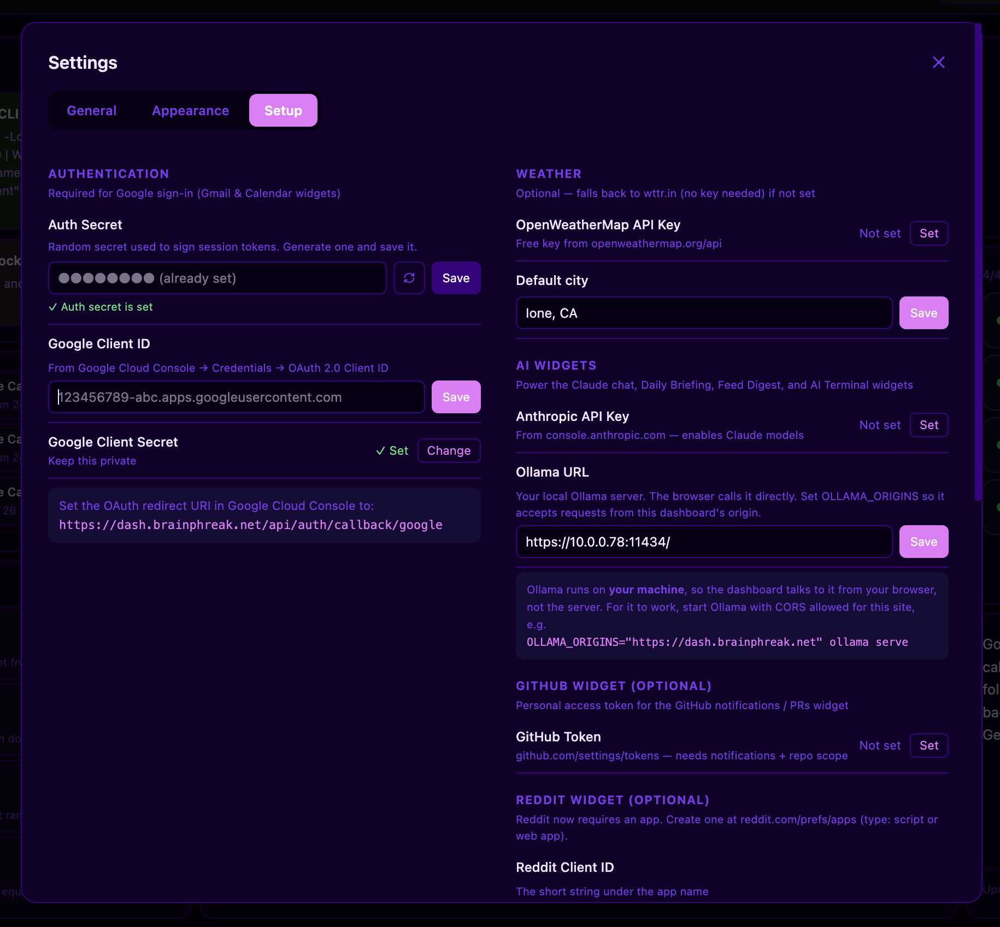
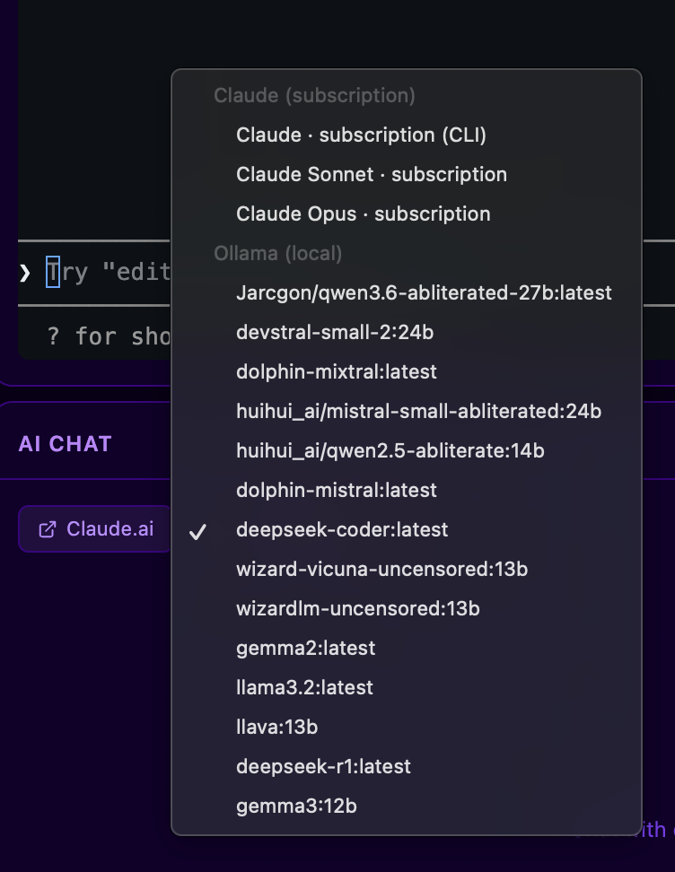
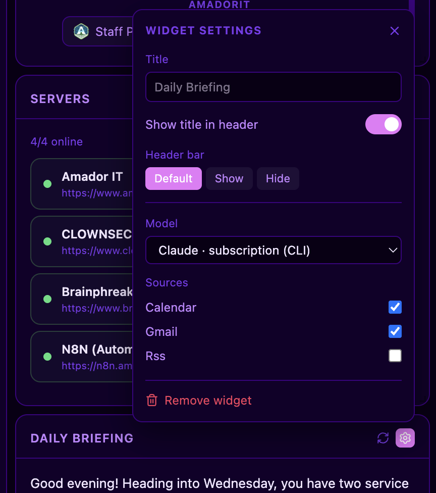
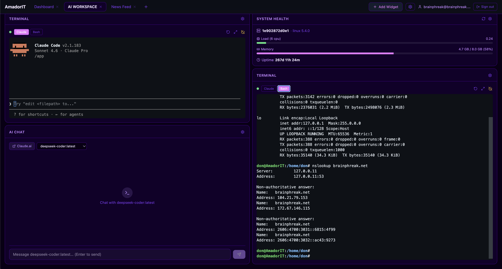

# Glimpse

A self-hosted personal dashboard with **drag-and-drop widgets**, **built-in AI** (Claude *and* local Ollama), Google Gmail/Calendar, RSS/Reddit, a real browser terminal, and more — all configurable from the browser, no file editing required. A spiritual successor to "glance"-style dashboards, with AI baked in.

Built with Next.js 16, React, SQLite, and `react-grid-layout`. Runs identically on **Linux, macOS, and Windows** via Docker.



---

## Highlights

- **Drag-and-drop grid** — resize and rearrange any widget; multiple tabbed dashboards, each with its own layout
- **AI, three ways** — chat/summaries powered by the **Anthropic API**, your **Claude subscription** (via the bundled `claude` CLI — no API bill), or **local Ollama** models. Pick per widget.
- **AI widgets** — streaming AI Chat (web search + image/vision), Daily Briefing (summarises your next 2 days of calendar + unread email + headlines), Feed Digest (multi-source — summarises any mix of your RSS, News, and Reddit feeds at once), and a terminal-styled AI REPL
- **20+ widgets** — clock, weather, calendar, Gmail, notes, links, news (image cards), RSS, Reddit, stocks, crypto, GitHub, Docker, system health, world clocks, server monitor, read-later, terminal, custom HTML/image/iframe
- **In-browser setup** — API keys, OAuth, and integrations are configured from **Settings → Setup**; stored in SQLite, no restart needed
- **Themes** — Default, Light, Matrix, Neon, Retro, Gameboy, Midnight, Dracula + full per-colour customisation
- **Persistent terminal** — a real cross-platform shell (bash/zsh/PowerShell) over WebSocket, plus the `claude` CLI; sessions survive disconnects and **auto-reconnect**
- **Backup** — export/import all pages, widgets, notes, links, and servers as JSON
- **Always-on** — `restart: unless-stopped`; survives reboots

---

## Widget catalogue

| Widget | Description |
|---|---|
| **AI Chat** | Streaming chat across Claude (API), Claude (subscription/CLI), and local Ollama models; web search + image input (vision) |
| **Daily Briefing** | AI summary of today's calendar, unread email, and headlines |
| **Feed Digest** | AI summary across multiple sources at once — tick any of your RSS / News feeds and subreddits (or all of them) |
| **AI Terminal** | Terminal-styled AI chat REPL (Claude or Ollama) |
| **Clock** | Live clock with optional date, timezone, label, colour |
| **World Clocks** | Time across multiple time zones |
| **Weather** | Current weather + forecast; no key (wttr.in) or OpenWeatherMap; °C/°F |
| **Calendar** | Google Calendar events (requires sign-in) |
| **Gmail** | Recent emails + unread count (requires sign-in) |
| **Notes** | Rich-text sticky notes with a pop-out editor |
| **Links** | Bookmark bar with categories and alignment |
| **Read Later** | Quick-save links to read later (per browser) |
| **News** | Headline cards with thumbnails, merged from one or more RSS feeds |
| **RSS Feed** | Any RSS/Atom feed |
| **Reddit** | Posts from any subreddit (requires a free Reddit app — see Reddit setup below) |
| **Crypto Ticker** | Live crypto prices (CoinGecko) |
| **Stock Ticker** | Live stock / ETF / index / crypto prices with day change (Yahoo Finance, no key) |
| **GitHub** | Your notifications and open pull requests |
| **Docker** | Container status on the host |
| **System Health** | CPU load, memory, and uptime |
| **Server Monitor** | HTTP health checks + one-click SSH command copy |
| **Terminal** | Real server-side shell over WebSocket (bash/zsh/PowerShell or the `claude` CLI); persistent + auto-reconnecting |
| **Custom HTML / Image / Iframe** | Render arbitrary HTML, an image/GIF, or embed any site |

---

## Screenshots

**Build any layout across multiple tabs** — here an AI workspace and a news feed:

| AI workspace | News feed |
|---|---|
|  |  |

**Add widgets** from the picker, and tune everything in **Settings**:

| Add widget | Settings — appearance/general/setup |
|---|---|
|  |  |
|  |  |

**AI everywhere** — pick a provider/model per widget (Claude API, Claude subscription, or local Ollama), and configure the Daily Briefing:

| Model picker | Daily Briefing settings |
|---|---|
|  |  |

Widget headers can be shown for quick access to each widget's controls:



---

## Quick start (Docker — recommended)

```bash
git clone https://github.com/brainphreak/glimpse.git
cd glimpse
cp .env.local.example .env.local      # set NEXTAUTH_SECRET + NEXTAUTH_URL at minimum
docker compose up -d --build
```

Open **http://localhost:3000**. Everything else (API keys, Google OAuth, AI providers) can be set from **Settings → Setup** in the browser.

> Same `docker compose up -d --build` works on Linux, macOS (Docker Desktop), and Windows (Docker Desktop). `restart: unless-stopped` keeps it running across reboots.

### Without Docker

Requires Node.js 20+, Python 3, `make`, `g++` (for `better-sqlite3` and `node-pty`):

```bash
npm install
cp .env.local.example .env.local
npm run build
node server.js            # production (includes the terminal). http://localhost:3000
# or: npm run dev          # development (no terminal backend)
```

> The terminal widget needs the custom `server.js` — `npm run dev` / `next start` alone won't power it.

---

## AI providers

Glimpse's AI widgets work with any of three providers; each AI widget has a model picker.

| Provider | Cost | Setup |
|---|---|---|
| **Claude (API)** | Paid per token | Add `ANTHROPIC_API_KEY` in Settings → Setup (or `.env.local`) |
| **Claude (subscription / CLI)** | Uses your Claude plan, no API bill | The `claude` CLI ships in the image. Open a **Terminal** widget, run `claude`, and `/login`. (To enable it in a container, mount your Claude creds — see the `docker-compose.yml` comment.) |
| **Ollama (local)** | Free / local | Run Ollama, set its URL in Settings → Setup |

### Ollama notes

The browser calls Ollama **directly** (it usually runs on your machine/LAN, not the dashboard server). Two gotchas:

- **CORS** — start Ollama allowing the dashboard origin: `OLLAMA_HOST=0.0.0.0:11434 OLLAMA_ORIGINS="*" ollama serve`
- **Mixed content** — an **HTTPS** dashboard page cannot call a plain-**HTTP** Ollama. Either browse the dashboard over `http://` on your LAN, **or** put Ollama behind HTTPS.

To use Ollama from an HTTPS dashboard, put a TLS reverse proxy in front of it. `scripts/ollama-caddy-setup.ps1` automates this on Windows (Caddy + Let's Encrypt via Cloudflare DNS) — point a subdomain at the Ollama host and set the dashboard's Ollama URL to `https://that-subdomain`.

A ~24 GB GPU comfortably runs a 32B model at 4-bit (e.g. `qwen2.5:32b`); use `ollama ps` to confirm it's 100% on GPU.

---

## Configuration

Most settings live in **Settings → Setup** (stored in SQLite, applied immediately). `.env.local` is the fallback / bootstrap. See `.env.local.example` for the annotated template.

| Variable | Purpose |
|---|---|
| `NEXTAUTH_SECRET` | Session-signing secret (`openssl rand -base64 32`). Must be an env var. |
| `NEXTAUTH_URL` | The exact URL you browse from (`http://localhost:3000`, `http://<lan-ip>:3000`, or `https://dash.example.com`) |
| `DISABLE_AUTH` | Set to `1` to skip Google sign-in entirely (open access — for a trusted LAN). Leave unset in production. |
| `GOOGLE_CLIENT_ID` / `GOOGLE_CLIENT_SECRET` | Google OAuth (Gmail + Calendar) |
| `ANTHROPIC_API_KEY` | Claude (API) provider |
| `OLLAMA_URL` | Ollama endpoint the browser calls (default `http://localhost:11434`) |
| `GITHUB_TOKEN` | GitHub widget (notifications + PRs) |
| `REDDIT_CLIENT_ID` / `REDDIT_CLIENT_SECRET` | Reddit widget + Reddit feeds in Feed Digest (see Reddit setup below) |
| `OPENWEATHERMAP_API_KEY` / `WEATHER_CITY` | Weather (optional; wttr.in used if no key) |
| `N8N_URL` / `N8N_API_KEY` | n8n integration (optional) |

### Google OAuth (Gmail + Calendar)

1. [Google Cloud Console](https://console.cloud.google.com/) → APIs & Services → Credentials → create an **OAuth 2.0 Client ID** (Web application)
2. Add the redirect URI shown in **Settings → Setup**: `<NEXTAUTH_URL>/api/auth/callback/google`
3. Enable the **Gmail API** and **Google Calendar API**
4. Paste the Client ID & Secret into **Settings → Setup** (or set the env vars)

> `NEXTAUTH_URL` and the redirect URI must match the host you actually open. For LAN access add `http://<lan-ip>:3000/api/auth/callback/google` too.

### Reddit (for the Reddit widget + Reddit feeds in Feed Digest)

Reddit blocks anonymous access, so the widget authenticates with a free Reddit app:

1. Go to [reddit.com/prefs/apps](https://www.reddit.com/prefs/apps) → **create another app…**
2. Type: **script** (or **web app**) — both give you a secret. Redirect URI can be `http://localhost:3000` (unused). The "about"/source URL is optional.
3. Copy the **client ID** (under the app name) and the **secret** into **Settings → Setup → Reddit**.

> Reddit may require accepting their Responsible Builder Policy and a verified email before app creation, and newly-created apps can take a short while to be approved.

---

## Security notes

- **The Terminal widget is a real shell** on the host (and the bundled `claude` CLI). **Never** expose this dashboard to the internet without `HTTPS` + authentication. Do not combine `DISABLE_AUTH=1` with a public endpoint.
- Secrets live in `.env.local` (gitignored) and the SQLite `config` table — neither is committed. The Docker image does **not** bake in `.env.local`.
- For remote access, prefer a VPN (e.g. Tailscale/WireGuard) or a reverse proxy with TLS + an auth gate over raw port-forwarding.

---

## Data & backup

All data is one SQLite file (`DATABASE_PATH`; in Docker, the `glimpse_data` volume at `/data/dashboard.db`).

| Table | Contents |
|---|---|
| `dashboard_layout` | One row per tab — name, widget definitions, grid layout |
| `notes` / `links` / `servers` | Widget data |
| `config` | API keys, OAuth creds, appearance/theme settings |

**Settings → General → Export / Import** downloads/restores everything (all tabs included) as JSON.

---

## Architecture

```
glimpse/
├── app/api/            # Route handlers: auth, layout, pages, config, settings,
│                       #   notes, links, servers, weather, rss, reddit, gmail,
│                       #   calendar, claude (+ /stream, /cli), feeds, github,
│                       #   docker, sysinfo, export, import
├── components/
│   ├── Dashboard.tsx        # Tabs, grid, widget rendering
│   ├── WidgetWrapper.tsx    # Widget chrome + hooks (useWidgetSettings/Refresh/Header)
│   ├── SettingsModal.tsx    # Appearance / General / Setup
│   └── widgets/             # One file per widget
├── lib/
│   ├── db.ts           # SQLite (better-sqlite3)
│   ├── config.ts       # getConfig/setConfig (DB + env fallback)
│   ├── auth.ts         # Edge-safe auth for middleware
│   └── ai.ts           # Client-side AI layer (Claude API / CLI / Ollama)
├── server.js           # Custom Next server + WebSocket PTY (terminal)
├── scripts/            # ollama-caddy-setup.ps1 (HTTPS proxy for Ollama on Windows)
├── Dockerfile · docker-compose.yml
```

---

## License

MIT
